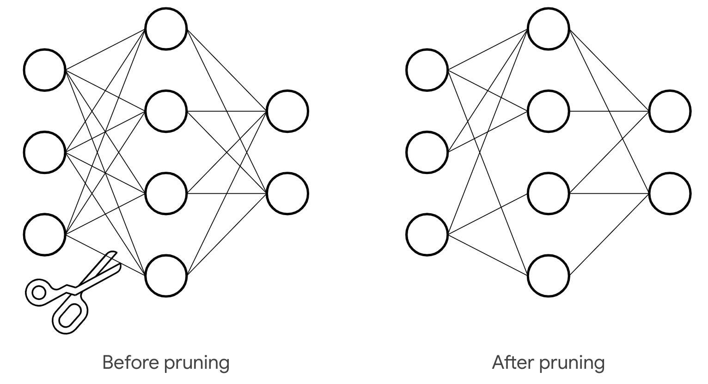
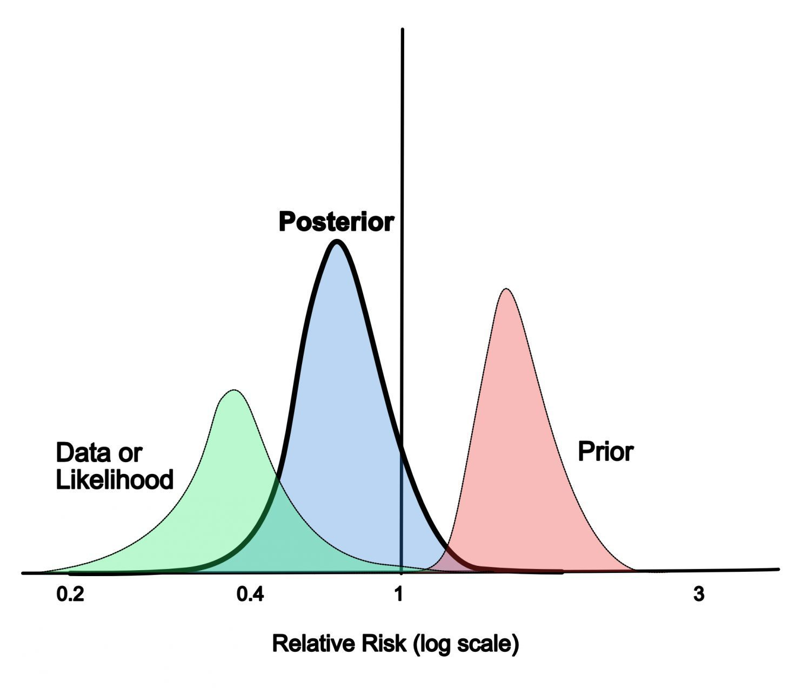
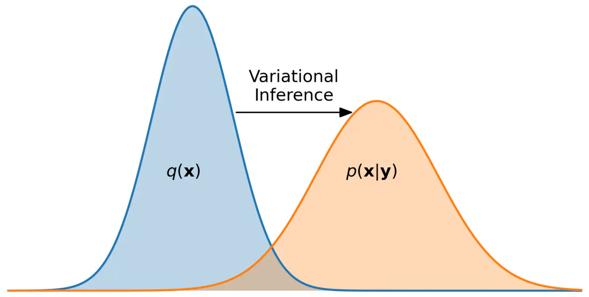
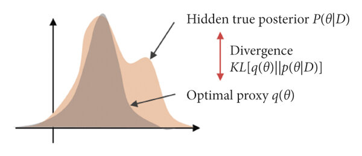
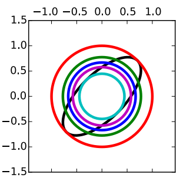
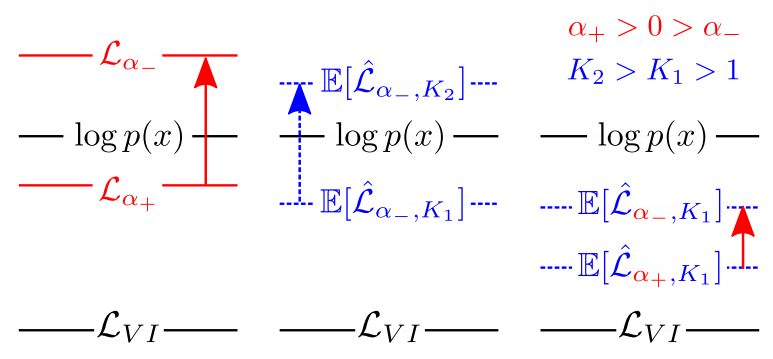

# Bayesian approach in neural networks for model pruning

{width=70%}

## Intro

Using deep learning in solving complex, real-world problems has become quite an engineering routine. But we should never forget about the probabilistic sense inside models and loss minimization. So here, we are going to recall that probabilistic framework and extend it to the *Bayesian* framework. Such switching will give us pleasant perks but it is not always for free. The main applicition presented in the blog will be neural networks *pruning* but other directions will be mentioned too.

So we will present 4 Bayesian techniques to envelope any task involving neural networks. If you get interested in the topic and want to use it on practice, you are welcome at our *pytoch* [library](https://github.com/intsystems/bayes_deep_compression).

<!-- more -->

## Making neural network Bayesian

The usual ML problem setup consists in minimising the loss function $L$ between the train targets $y$ and parametrical model $f_{\mathbf{w}}(\mathbf{x})$. We assume the model to be some neural network parameterized by $\mathbf{w}$. At the same time, the loss together with the model define data's distribution $p(y | \mathbf{x}, \mathbf{w})$. Minimising the loss w.r.t. $\mathbf{w}$ is equivalent to finding maximum likelihood estimation $\hat{\mathbf{w}}$ of model's parameters. Finally, to obtain target distribution on the **new** *object* $\hat{\mathbf{x}}$ we just use learnt estimation and have $p(y | \hat{\mathbf{x}}, \hat{\mathbf{w}})$.

The Bayesian approach complements the model with a *prior* distribution $p(\mathbf{w} | \Theta)$ . It is generally parameterized by *hyperparameters* $\Theta$ (but prior can be a fixed distribution as well). This move kind of changes the game because now target distribution for a new object $\hat{\mathbf{x}}$ is trickier

$$
   p(y | \hat{\mathbf{x}}, \Theta) = \int p(\mathbf{w} | y, \mathbf{x}, \Theta) p(y | \hat{\mathbf{x}}, \mathbf{w}) d\mathbf{w} = \mathbb{E}_{\mathbf{w} \sim p(\mathbf{w} | y, \mathbf{x}, \Theta)} [p(y | \hat{\mathbf{x}}, \mathbf{w})] , \label{new_point}\tag{1}
$$

where $p(\mathbf{w} | y, \mathbf{x}, \Theta)$ is a *posterior* distribution of the model's parameters based on the train data. Unfortunately, finding the posterior is typically intractable in case of the NNs. That leads to the intractability of the prediction. Another problem here is how to choose optimal hyperparameters $\Theta$ if we don't know them from some prior (expert) knowledge.

## Why Bayes may be useful?

In spite of the mentioned difficulties, Bayesian framework has a lot to give. You've might already heard that [*L2 regularization*](https://en.wikipedia.org/wiki/Regularization_(mathematics)) is equal to simple gaussian prior. Furthermore, nets *pruning* is possible using the very same gaussian or more sparsity-inducing priors (e.g. [Laplace prior](https://en.wikipedia.org/wiki/Laplace_distribution)).

Some other bayes features:

- The formula ($\ref{new_point}$) implies [*assembling*](https://en.wikipedia.org/wiki/Ensemble_learning) your model to evaluate prediction for a new data point. To see it, you may evaluate expectation with Monte_Carlo samples drawn from posterior. Major benefit here is using more information about true model state in the final prediction. It also prevents models from being [*over-confident*](https://docs.giskard.ai/en/latest/knowledge/key_vulnerabilities/overconfidence/index.html), see illustrative picture under.

{ width=70% }
/// caption
*Confidence shift in distribution after incorporating prior knowledge*
///

- Bayes can be used to perform [*model selection*](https://en.wikipedia.org/wiki/Model_selection), for example see [*hidden state models*](https://en.wikipedia.org/wiki/Latent_space) and learning [*mixture of gaussians*](https://scikit-learn.org/1.5/modules/mixture.html#variational-Bayesian-gaussian-mixture).

We have provided only a handful of applications, but this might be enough to spark your interest. Now, we will go through methods that will overcome problems with bayessian framework and make it usable.

## Variational inference

One of the ways to add a Bayesian layer of inference to your neural network - *variational inference* principle. It is built upon special function called [*evidence*](https://en.wikipedia.org/wiki/Bayesian_inference#Formal_explanation) which is

$$
    p(y | \mathbf{x}, \Theta) = \mathbb{E}_{p(\mathbf{w} | y, \mathbf{x}, \Theta)} [p(y | \mathbf{x}, \mathbf{w})].
$$

It's similar to ($\ref{new_point}$) but it has training object $\mathbf{x}$ in the left. The function basically indicates how probable the given data is under varying hyperparameters. Maximising this function is a key to finding optimal $\Theta$. But it can also help with the posterior! Following the [ELBO](https://en.wikipedia.org/wiki/Evidence_lower_bound) technic, introduce *variational* distribution $q(\mathbf{w} | \phi)$ which is parameterized by $\phi$. This distribution is supposed to approximate the posterior $p(\mathbf{w} | y, \mathbf{x}, \Theta)$ (see picture under) and in theory can be anything we want. Then, it can be shown that the following expression is *evidence lower bound*

$$
   \text{ELBO}(\Theta, \phi) = \mathbb{E}_{\mathbf{w} \sim q(\mathbf{w} | \phi)} [p(y | \mathbf{x}, \mathbf{w})] + \text{KL}(q(\mathbf{w} | \phi) || p(\mathbf{w} | \Theta))
$$

or in terms of the loss and the model

$$
   \text{ELBO}(\Theta, \phi) = \mathbb{E}_{\mathbf{w} \sim q(\mathbf{w} | \phi)} [L(y, f_{\mathbf{w}}(\mathbf{x}))] + \text{KL}(q(\mathbf{w} | \phi) || p(\mathbf{w} | \Theta))
$$

where $\text{KL}(\cdot || \cdot)$ is a [KL-divergence](https://en.wikipedia.org/wiki/Kullback%E2%80%93Leibler_divergence). Maximising it by $\phi$ and $\Theta$ gives us estimation of the optimal hyperparameters and the variational distribution.

{ width=70% }
/// caption
*ELBO optimization is equal to posterior fitting*
///

### Using variational distribution

If you are not interested in hyperparameters, you can just use trained $q(\mathbf{w} | \phi^*)$ to get the desired prediction. The ($\ref{new_point}$) can be estimated as

$$
   p(y | \hat{\mathbf{x}}, \Theta) \approx \mathbb{E}_{\mathbf{w} \sim q(\mathbf{w} | \phi^*)} [p(y | \hat{\mathbf{x}}, \mathbf{w})].
$$

It is usually approximated futher with Monte-Carlo. On the other hand, you can find the [MAP](https://en.wikipedia.org/wiki/Maximum_a_posteriori_estimation) estimation: $\mathbf{w}^* = \underset{\mathbf{w}}{\text{argmax }} q(\mathbf{w} | \phi^*)$, and simplify it to

$$
   p(y | \hat{\mathbf{x}}, \Theta) \approx p(y | \hat{\mathbf{x}}, \mathbf{w}^*).
$$

This expression is equal to just using your model $f_{\mathbf{w}}(\mathbf{x})$ with $\mathbf{w} = \mathbf{w}^*$ for prediction.

### Choosing variational distribution

As it was mentioned, there are no limits on $q(\mathbf{w} | \phi)$ except to be computable. But to make the whole thing practical and use *gradient optimization* it should comply with several requirements.

#### [Reparameterization trick](https://en.wikipedia.org/wiki/Reparameterization_trick)

In order to estimate and compute the gradient of the expectation in $\text{ELBO}(\Theta, \phi)$ the $q$ must "separate" the randomness from $\mathbf{w}$. Namely, introduce some deterministic function $h$ parameterized by $\phi$ and some random variable $\epsilon$, usually with simple distribution $p(\epsilon)$ from which we can sample. Now, randomness of $\mathbf{w}$ is expressed through the randomness of $\epsilon$

$$
   \mathbf{w} \sim q(\mathbf{w} | \phi) \Leftrightarrow \mathbf{w} = h(\mathbf{w}, \phi, \epsilon), \ \epsilon \sim p(\epsilon).
$$

This trick enables us to estimate the expectation in ELBO and compute its gradients:

\begin{align}
   \mathbb{E}_{\mathbf{w} \sim q(\mathbf{w} | \phi)} [p(y | \mathbf{x}, \mathbf{w})] &\approx \frac{1}{K} \sum_{i = 1}^K p(y | \mathbf{x}, \mathbf{w}_i) = \frac{1}{K} \sum_{i = 1}^K L(y, f_{\mathbf{w}_i}(\mathbf{x})), \\
   \nabla \mathbb{E}_{\mathbf{w} \sim q(\mathbf{w} | \phi)} [p(y | \mathbf{x}, \mathbf{w})] &\approx \frac{1}{K} \sum_{i = 1}^K \nabla L(y, f_{\mathbf{w}_i}(\mathbf{x})).
\end{align}

where $\mathbf{w}_i = h(\mathbf{w}, \phi, \epsilon_i)$, $\epsilon_i \sim p(\epsilon)$ and $K$ is the number of samples.

#### KL computation

To optimise $\text{ELBO}(\Theta, \phi)$ it is necessary to compute KL term between $q(\mathbf{w} | \phi)$ and $p(\mathbf{w} | \Theta)$  plus its gradients. As the choice of distributions is arbitrary and task-dependent, we do not discuss it further. One general solution here can be Monte-Carlo estimation:

$$
   \text{KL}(q(\mathbf{w} | \phi) || p(\mathbf{w} | \Theta)) \approx \frac{1}{M} \sum_{i = 1}^M \log \frac{q(\mathbf{w}_i | \phi)}{p(\mathbf{w}_i | \Theta)},
$$

where $\mathbf{w}_i \sim q(\mathbf{w} | \phi)$. Several particular solutions will be given futher.

#### Posterior approximation

Ideally, the class of variational distributions parametrized by $\phi$ should contain $p(\mathbf{w} | y, \mathbf{x}, \Theta)$. If $q$ is exactly posterior then the ELBO will be exactly the evidence (not just lower bound)!

Practically, we don't know the exact posterior but we know it up to the normalisation. It is followed from thes Bayesian theorem:

$$
   p(\mathbf{w} | y, \mathbf{x}, \Theta) \propto p(y | \mathbf{w}, \mathbf{x}) p(\mathbf{w} | \Theta).
$$

This can be a hint for choosing variational distributions class. For example, if you know that $p(\mathbf{w} | y, \mathbf{x}, \Theta)$ have some special properties, make sure that functions from $q$ class have them too (for example, multimodality, see picture under).

{ width=80% }
/// caption
*Unimodal variational distribution can't fit multimodal posterior*
///

### Pruning strategy

Finally, let's learn variational pruning technic. Generally, it is based on the probability mass of the distribution $q$ in the $w_i = 0$ points. Here $w_i$ represents each individual weight of the model. If probability of this point is high, the weight is considered to be zero.

For example, if $q$ is a factorized gaussian ([Graves](https://papers.nips.cc/paper_files/paper/2011/hash/7eb3c8be3d411e8ebfab08eba5f49632-Abstract.html), 2011) meaning $w_i \sim \mathcal{N}(w_i | \mu_i, \sigma_i^2)$, then $\log q(w_i = 0) \propto -\dfrac{\mu_i^2}{2 \sigma_i^2}$. Set upper threshold on this value and we obtain pruning rule for individual weights:

$$
   \left| \dfrac{\mu_i}{\sigma_i} \right| < \lambda \Rightarrow \text{prune}.
$$

Similar rules can be derived for more tricky distributions like *log-uniform* or *half-Cauchy* ([Christos Louizos et. al.](https://proceedings.neurips.cc/paper_files/paper/2017/file/69d1fc78dbda242c43ad6590368912d4-Paper.pdf), 2017). The main practical issue here is whatever $q$ you choose it should **factorize** weights into small groups. Otherwise it would be impossible to compute marginal distributions on individual weights in reasonable time.

## Renyi-divergence

Another Bayesian approach ([Yingzhen Li et. al.](https://arxiv.org/abs/1602.02311), 2016) is actually an extension of the variational inference. The main idea is to substitute KL divergence with the [*Renyi* divergence](https://en.wikipedia.org/wiki/R%C3%A9nyi_entropy)

$$
   D_{\alpha} [p || q] = \frac{1}{\alpha - 1} \log \int p(\mathbf{w})^{\alpha} q(\mathbf{w})^{1 - \alpha} d \mathbf{w}.
$$

Formally, $\alpha \ge 0$. But it is possible to set $\alpha < 0$ although it won't be [divergence](https://en.wikipedia.org/wiki/Divergence_(statistics)) mathematically.

Let's denote the new ELBO functional as $\text{ELBO}_{\alpha}$. Also denote by $\alpha_+$ any $\alpha \in [0, 1]$ and by $\alpha_-$ any $\alpha < 0$. The great feature of the Reniu functional is flexibility. It is possible to show that varying $\alpha$ we can obtain an old $\text{ELBO} = \underset{\alpha \to 1}{\lim} \text{ELBO}_{\alpha}$ or even true evidence $p(y | x) = \underset{\alpha \to 0}{\lim} \text{ELBO}_{\alpha}$. Generally, we have the following relations

$$
   \text{ELBO} = \underset{\alpha \to 1}{\lim} \text{ELBO}_{\alpha} \le \text{ELBO}_{\alpha_+} \le p(y | x) = \underset{\alpha \to 0}{\lim} \text{ELBO}_{\alpha} \le \text{ELBO}_{\alpha_-}.
$$

Visual example below demonstrates evolution of fitted variational distribution depending on $\alpha$. The task is [Bayesian linear regression](https://en.wikipedia.org/wiki/Bayesian_linear_regression). **Black** line corresponds to the exact posterior. It is multivariate gaussian with covariant components. Chosen variational distribution family is factorized gaussians.

We go from the  cyan circle  corresponding to $\alpha \to \infty$. It can be referred to as *mode-seeking* ELBO regime. This gaussian lies exactly inside true gaussian and is perfectly centred around the mode. Then, decreasing $\alpha$ to 1 we obtain  violet circle  corresponding to conventional ELBO. After that, we get more inflated  blue circle  with $\alpha = 0.5$ and *optimal*  green circle  with $\alpha = 0$. In this case, variational distribution is true marginal distribution of the parameters

$$
   q (\mathbf{w}) = p(w_1 | y, x) \cdot p(w_2 | y, x)
$$

and delivers true evidence $\text{ELBO}_{0} = \text{ELBO}$.

If $\alpha$ is decreased further, we switch to the so called *mass-covering* regime. The   red circle  corresponds to $\alpha \to -\infty$. As we can see it hasn't inflated over the whole plane but has become a perfect encapsulation of the true posterior. To conclude, fitting models for different $\alpha$ is a great way to control distribution of probability mass around the true posterior.

{ align=center }
/// caption
*Evolution of variational distributions for different $\alpha$*
///

### Renyi approximation

Let's rewrite $\text{ELBO}_{\alpha}$ in another way

$$
   \text{ELBO}_{\alpha} = \frac{1}{1 - \alpha} \log \mathbb{E}_{\mathbf{w} \sim q} [\left( \frac{p(y, \mathbf{w} | x)}{q(\mathbf{w})} \right)^{1 - \alpha}]
$$

Unfortunately, this loss is equally intractable for deep learning models as ELBO in variational inference. But key walkarounds towards feasibility stay the same: the reparametrization trick and monte-carlo estimation. Imagine we have $\mathbf{w} = h(\mathbf{w}, \phi, \epsilon), \ \epsilon \sim p(\epsilon)$ and $K$ samples from this distribution, then estimated loss is

\begin{multline}
   \text{ELBO}_{\alpha} = \frac{1}{1 - \alpha} \log \mathbb{E}_{\epsilon} [\left( \frac{p(y, \mathbf{w} | x)}{q(\mathbf{w})} \right)^{1 - \alpha}] \approx \\ \approx \frac{1}{1 - \alpha} \log \frac{1}{K} \sum_{i = 1}^K [\left( \frac{p(y, \mathbf{w}_i | x)}{q(\mathbf{w}_i)} \right)^{1 - \alpha}] =: \widehat{\text{ELBO}}_{\alpha}.
\end{multline}

As $p(\epsilon)$ is usually standard normal it is easy to take gradient over this estimation.

The only problem here is that the new loss is actually *biased*. But as authors of the approach proved this bias *monotonously* vanishes with more samples. Moreover, with fixed $K$ you can play around with $\alpha$ as $\widehat{\text{ELBO}}_{\alpha}$ is *non-decreasing* on $\alpha$. Combining earlier facts we can obtain that either $\widehat{\text{ELBO}}_{\alpha} < p(y|x)$ for all $\alpha$ or their exists **optimal** $\alpha_K$ such that $\widehat{\text{ELBO}}_{\alpha_K} = p(y|x)$!

The illustration below shows relations between $\text{ELBO}_{\alpha}$ for diffrent $\alpha$/fixed $K$ and vice versa. It is denoted here as $\mathcal{L}_{\alpha}$. True evidence is denoted as $\log p(x)$. Conventional elbo here is $\mathcal{L}_{VI}$.

{ width=60% }
/// caption
*Illustration of how Renyi loss is changed under different variations*.
///

So, regarding discussed guarantees the approach is possible to be realized on practise.

## Kroneker-factorized Laplace

The key advantage of the last Bayesian approach ([Hippolyt Ritter et. al.](https://discovery.ucl.ac.uk/id/eprint/10080902/1/kflaplace.pdf), 2018) is that it is applicable to **trained** NNs with definite *layer structure*. We assume each layer to be linear transform followed by activation function. Imagine we have no prior for now, only likelihood $\log p(y | \mathbf{w}, \mathbf{x})$. We can use second order approximation around likelihood maximum denoted by $\mathbf{w}^*$

$$
   \log p(y | \mathbf{w}, \mathbf{x}) \approx \log p(y | \mathbf{w}^*, \mathbf{x}) + (\mathbf{w} - \mathbf{w}^*)^{\text{T}} H (\mathbf{w} - \mathbf{w}^*).
$$

Here $H$ is a hessian of the likelihood in the maximum point that we don't know. However, we do know $\mathbf{w}^*$ (it is our trained model). The approximation gives us normal distribution for net's parameters

$$
    \mathbf{w} \sim \mathcal{N}(\mathbf{w}^*, H^{-1}).
$$

Actually, the result would be the same even if we had some fixed prior in the beginning. In this case, the likelihood function is substituted for posterior $p(\mathbf{w} | y, \mathbf{x})$. Now $\mathbf{w}^*$ is the MAP model, $H$ is the hessian of the posterior. Simple example of this transition is incorporation of the L2-regularization.

It must be said that laplace approximation is not a panacea. The picture below illustrates how far from reality it can be. But for now we assume that it's applicable.

{ width=70% }
/// caption
Laplace approximation of an arbitary distribution.

As you can see, it is not always quite accurate.
///

### Pruning strategy

If we knew $H$ and $\mathbf{w}^*$, pruning could be based on the probability mass in $w_i = 0$.So it is similar to the pruning in the [variational approach](#variational-inference). The major concern here is again factorization into parameters groups, namely by NN's layers. The authors of the approach showed that if we assume layer's independence, the hessian will factorize into a block-diagonal matrix. Therefore we will have independent gaussians for each layer! Computing marginals $q(w_i)$ will be absolutely feasible.

### Hessian factorization

Let's see what is the hessian's structure on each layer. Denote hessian of the layer $\lambda$ as $H_{\lambda}$, then it can be shown that

$$
   \mathbb{E}[H_{\lambda}] = \mathbb{E}[\mathcal{Q}_{\lambda}] \otimes \mathbb{E}[\mathcal{H}_{\lambda}],
$$

where $\mathcal{Q}_{\lambda} = a_{\lambda-1}^{\text{T}} a_{\lambda-1}$ is a covariance of the incoming *activations* $a_{\lambda-1}$ and $\mathcal{H}_{\lambda} = \dfrac{\partial^2 L}{\partial h_{\lambda} \partial h_{\lambda}}$ is the hessian of the loss w.r.t. linear *pre-activations* $h_{\lambda}$.

Expectations here can be estimated by Monte-Carlo. The $\mathcal{H}_{\lambda}$ is actually quite heavy to compute but can be estimated using [KFRA](https://arxiv.org/abs/1706.03662) or [KFAC](https://arxiv.org/abs/1503.05671) algorithms (in terms of the implementation, these are most cumbersome).

Ultimately, the distribution on layer weights is [matrix normal](https://en.wikipedia.org/wiki/Matrix_normal_distribution)

$$
   \mathbf{w}_{\lambda} \sim \mathcal{MN}(\mathbf{w}^*_{\lambda}, \mathcal{Q}_{\lambda}^{-1}, \mathcal{H}_{\lambda}).
$$

## Conclusion

We have enough mathematics for now :relieved:. I hope you have enjoyed the concept of Bayesian inference and now understand how it can be useful in applications. Some practical python libraries are [Bayesian Neural Networks](https://github.com/JavierAntoran/Bayesian-Neural-Networks?tab=readme-ov-file#stochastic-gradient-hamiltonian-monte-carlo), [pyro](https://pyro.ai/) and our developing library [bayescomp](https://github.com/intsystems/bayes_deep_compression). You can find many examples of using bayes approach in their docs.