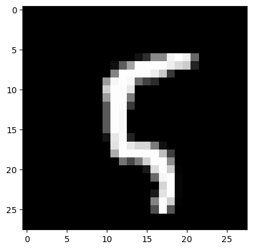

## Training a Bayesian model based on the PyTorch model
The library is powered by pythorch. So first we need to create a model from pythorch that we want to train.
```python
import torch
import torchvision
import matplotlib.pyplot as plt
import torchvision.transforms as transforms
import torch.nn as nn 
import torch.optim as optim 
import torch.nn.functional as F
import sys
```

Create a simple classifier, which will be our base model, which we want to train and prune.


```python

class Classifier(nn.Module): 
    def __init__(self, classes: int = 10): 
        super().__init__() 
        self.conv1 = nn.Conv2d(1, 32, kernel_size=3, padding=1) 
        self.conv2 = nn.Conv2d(32, 64, kernel_size=3, padding=1) 
        self.pool = nn.MaxPool2d(2, 2) 
        #self.dropout1 = nn.Dropout2d(0.25) 
        #self.dropout2 = nn.Dropout2d(0.5) 
        self.fc1 = nn.Linear(64 * 7 * 7, 128) 
        self.fc2 = nn.Linear(128, classes) 
  
    def forward(self, x): 
        x = self.pool(F.relu(self.conv1(x))) 
        #x = self.dropout1(x) 
        x = self.pool(F.relu(self.conv2(x))) 
        #x = self.dropout2(x) 
        x = x.view(-1, 64 * 7 * 7) 
        x = F.relu(self.fc1(x)) 
        x = self.fc2(x) 
        return x
```

Load the MNIST dataset on which we want to train our classifier.


```python
test_dataset = torchvision.datasets.MNIST(root='./data', train=True, download=True, transform=transforms.ToTensor())
train_dataset = torchvision.datasets.MNIST(root='./data', train=False, download=True, transform=transforms.ToTensor())
```

Next, we need to turn the model into a Bayesian model. To do this, we need to wrap in BayesLayer (LogUniformVarLayer) the layers for which we want to apply Bayesian learning. And also BayesNet (VarBayesNet), which stores all Bayesian layers and the original network.
To select a specific learning method, we need to select BaseLoss(LogUniformVarKLLoss), which knows how to work with the selected layers.

## Creating a Bayesian model based on nn.Module
```python
from src.methods.bayes.variational.net import LogUniformVarLayer, VarBayesNet #Первым модулоем мы оборачиваем те слои модели, которые мы хотим сделать байесовыми, второй модуль это сама байесовская сеть
from src.methods.bayes.variational.optimization import LogUniformVarKLLoss #Это лосс байесовской модели, который отвечает за тип обучения. Всегда рекомендуется использовать специализированный лосс, но для большинства распределений его нет
```


The first thing we'll do is create our base model


```python
module = Classifier()
```

Next, we turn some layers into Bayesian using LogUniformVarBayesModule. And create a list of all layers nn.ModuleList([layer1, layer2, ...]) that we want to train (including layers that are not Bayesian). Note that it is possible to wrap the whole network and pass a list consisting only of it.


```python
var_module1 = LogUniformVarLayer(module.conv1)
bayes_model = VarBayesNet(module, nn.ModuleDict({'conv1': var_module1}))
```

## Example of a training step
Let's see what the learning step looks like for the network.

```python
optimizer = optim.Adam(bayes_model.parameters(), lr=1e-3)
```

In general, it is no different from a regular step, we just need to correctly aggregate losses from several samples on one step.

```python
#get one sample
#========
image, label = test_dataset[10]
y = bayes_model(torch.ones_like(image))
kl_loss = LogUniformVarKLLoss()
#========

#list of fit_loss for each sample (we have one sample)
fit_loss = [y.sum()]
 #list of dist_loss for each sample (we have one sample)
dist_loss = [kl_loss(posterior = bayes_model.posterior, prior = bayes_model.prior, param_sample_dict = bayes_model.weights)]
beta = 0.1 # scale factor betwenn dist_loss and data_loss
#aggregation result is stored in total_loss attribute, all others are provided for statistic of traininghow important each part is
aggregation_result = kl_loss.aggregate(fit_loss, dist_loss, beta) 
out = aggregation_result.total_loss # calculated loss for one step
#optimizer step
optimizer.zero_grad() 
out.backward() 
optimizer.step() 
```

You can create a network allocation simply from the allocation to parameters and the base network.


```python
net_distributon = VarBayesModuleNetDistribution(bayes_model.base_module, bayes_model.posterior)
#This is a pruner that zeros the weights depending on the density of the distribution at 00
net_distributon_pruner = BaseNetDistributionPruner(net_distributon)
#Here we set the MAP model weights  
net_distributon.set_map_params()
#Prune based on a certain threshold
net_distributon_pruner.prune(1.9)
#get basic model for evaluation
eval_model = net_distributon.get_model()
```

We got a model with the same architecture as the original one.


```python
print(eval_model.conv1.weight)
```

```python
print(bayes_model.state_dict())
```


Forward is done on the last saved sample. Note that we do not copy the data anywhere, and the model is not encapsulated. Therefore, in order to unlink them, they must be copied.


```python
print(bayes_model(torch.zeros_like(image)))
#print(bayes_model(torch.zeros_like(image), sample = False))
print(module(torch.zeros_like(image)))
```

It is recommended to use a GPU for training.

```python
device = torch.device("cuda" if torch.cuda.is_available() else "cpu")
device
```

## Training with the built-in trainer
Next we import several modules for training

The trainer itself, Trainer Parameters, Planner beta (ratio between normal and Bayesian loss), and a callback for accuracy metrics.
```python
from src.methods.bayes.variational.trainer import VarBayesTrainer, VarTrainerParams, Beta_Scheduler_Plato, CallbackLossAccuracy
```

List of callbacks

```python
from src.methods.report.base import ReportChain
```

And for some callback example. This callback module just outputs each step data from the trainer.

```python
from src.methods.report.variational import VarBaseReport 
```


Initialize the trainer. You don't have to write your own trainer. There is already a ready-made one for all variation methods.

Set the training parameters first.

```python
BATCH_SIZE=1000
EPOCHS=4000
LR = 1e-3 #5e-4
# Split the training set into training and validation sets 
VAL_PERCENT = 0.2 # percentage of the data used for validation 
SAMPLES = 10
BETA = 0.01 #5e-5 #0.01
BETA_FAC = 5e-1
PRUNE = 1.9#1.99, 2.1, 1.9
PLATO_TOL = 20

train_params = VarTrainerParams(EPOCHS, optimizer,fit_loss, kl_loss, SAMPLES, PRUNE, BETA, {'accuracy': CallbackLossAccuracy()})
```

Then we create a Bayesian network based on the usual one

```python
base_module = Classifier()
var_module1 = LogUniformVarLayer(base_module.conv1)
# First argument is the base network, second is a list of all layers (where the right ones are Bayesian)
model = VarBayesNet(base_module, nn.ModuleDict({'conv1': var_module1}))
```

Select the optimizer we want to use for the task

```python
optimizer = optim.Adam(model.parameters(), lr=LR)
```

Select the loss we want to use. It should be compatible with the module we are using. But note that not all modules are compatible with all losses, some losses are specific to certain modules.

```python
# The first lot is a normal data lot, the second lot is a Bayesian model lot
fit_loss = nn.CrossEntropyLoss() 
kl_loss = LogUniformVarKLLoss()
```

For stability of training it is recommended to use planarofschik beta

```python
#Use the planner for the proportionality coefficient between fit_loss and kl_loss
beta = Beta_Scheduler_Plato(BETA, BETA_FAC, PLATO_TOL)
beta_KL = Beta_Scheduler_Plato(beta.beta, 1 / BETA_FAC, PLATO_TOL, ref = beta, threshold=1e-4)


#This function will be executed after each coach step, 
#so we need to make a step in the planner and change the corresponding coefficient.
def post_train_step(trainer: VarTrainerParams, train_result: VarBayesTrainer.TrainResult):
    beta.step(train_result.fit_loss)
    beta_KL.step(train_result.dist_loss)
    trainer.params.beta = float(beta)
```

Initialize training and validation dataset

```python
#print(model.base_module.state_dict().keys())
val_size    = int(VAL_PERCENT * len(train_dataset)) 
train_size  = len(train_dataset) - val_size 

t_dataset, v_dataset = torch.utils.data.random_split(train_dataset,  
                                                        [train_size,  
                                                            val_size]) 

#Create DataLoaders for the training and validation sets 
train_loader = torch.utils.data.DataLoader(t_dataset,  
                                        batch_size=BATCH_SIZE,  
                                        shuffle=True, 
                                        pin_memory=True) 
eval_loader = torch.utils.data.DataLoader(v_dataset,  
                                        batch_size=BATCH_SIZE,  
                                        shuffle=False, 
                                        pin_memory=True) 
```

All nn.Module methods are safely applied to Bayesian models, including the fact that they can be transferred to another device quite easily

```python
model.to(device) 
```

Once we have created the Bayesian network, defined the loss and set the dataset we can start training, using the built-in trainer.

```python
#If we want to make the beta fixed, we need to remove the [post_train_step] argument.
#trainer = VarBayesTrainer(train_params, ReportChain([VarBaseReport()]), train_loader, eval_loader, [post_train_step])
trainer = VarBayesTrainer(train_params, ReportChain([VarBaseReport()]), train_loader, eval_loader)
trainer.train(model)

```

You can also save these models in their entirety to disk      

```python
torch.save(model.state_dict(), 'model_bayes.pt' )
```

And boot from the disk
```python
model.load_state_dict(torch.load('model_bayes.pt'))
image1, label1 = test_dataset[10]
image2, label2 = test_dataset[11]
model(image1)
```

You can also use the eval() function of the trainer to evaluate the model on a validation dataset

```python
val_loss = 0.0
val_acc = 0.0
PRUNE = 1.0
test_loader = torch.utils.data.DataLoader(test_dataset,  
                                         batch_size=BATCH_SIZE,  
                                         shuffle=False, 
                                         pin_memory=True) 
kl_loss = LogUniformVarKLLoss()
trainer.params.prune_threshold = PRUNE
test_result = trainer.eval(model, test_loader)
acc = test_result.custom_losses['val_accuracy']
print(f'Loss:{test_result.val_loss}, KL Loss: {test_result.dist_loss}, FitLoss: {test_result.fit_loss}, Accuracy {acc}, Prune parameters: {test_result.cnt_prune_parameters}/{test_result.cnt_params}')
```

## Pruning.
For model pruning, it is recommended to use some sort of deterministic model estimation. 
In the example, the pruning is first performed on the -1.0 value and then the MAP estimation of the parameters is set.

```python
model.to(device=device)
model.prune({'threshold': -1.0})
model.set_map_params()

```

This model can then be used as a deterministic model

```python
image, label = test_dataset[100]
plt.imshow(image.permute(1, 2, 0), cmap="gray")
print("Label:", label)
```

    Label: 5


    

    


```python
torch.max(model(image.cuda()).data, 1)
```


    torch.return_types.max(
    values=tensor([2.1405], device='cuda:0'),
    indices=tensor([5], device='cuda:0'))


